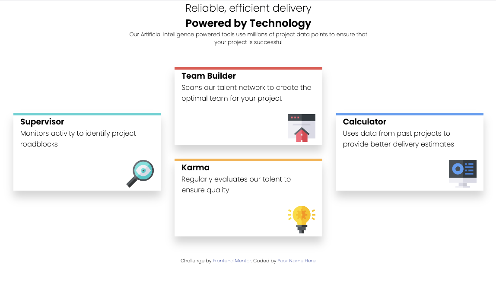

# Frontend Mentor - Four card feature section solution

This is a solution to the [Four card feature section challenge on Frontend Mentor](https://www.frontendmentor.io/challenges/four-card-feature-section-weK1eFYK). Frontend Mentor challenges help you improve your coding skills by building realistic projects.

## Table of contents

-   [Overview](#overview)
    -   [The challenge](#the-challenge)
    -   [Screenshot](#screenshot)
    -   [Links](#links)
    -   [Built with](#built-with)
    -   [What I learned](#what-i-learned)
-   [Author](#author)

**Note: Delete this note and update the table of contents based on what sections you keep.**

## Overview

### The challenge

Users should be able to:

-   View the optimal layout for the site depending on their device's screen size

### Screenshot



### Links

-   Solution URL: (https://github.com/mistergjones/07FourCardFeatureSection)
-   Live Site URL: (https://mistergjones.github.io/07FourCardFeatureSection/)

### Built with

-   Semantic HTML5 markup
-   CSS custom properties
-   CSS Grid

### What I learned

Utilising margin: 0 auto as per below means that the paragraph will sit centrally within its parent container. Its a great way to center an element.

Also utilised a GRID wiht NAMED AREAS. The below is how this was achieved.

```css
header > p {
    margin: 0 auto;
    width: 50%;
    font-size: 0.8rem;
}

.grid-container {
    margin-top: 3rem;
    margin-left: 2rem;
    margin-right: 2rem;
    display: grid;
    grid-template-columns: 1fr 1fr 1fr;
    grid-template-rows: 1fr 1fr 1fr 1fr;
    gap: 2em 2em;
    grid-template-areas:
        ". Area2 ."
        "Area1 Area2 Area4"
        "Area1 Area3 Area4"
        ". Area3 .";
    margin-bottom: 3rem;
}
```

## Author

-   Website - <a href="https://www.glenjones.com.au">Glen Jones</a>
